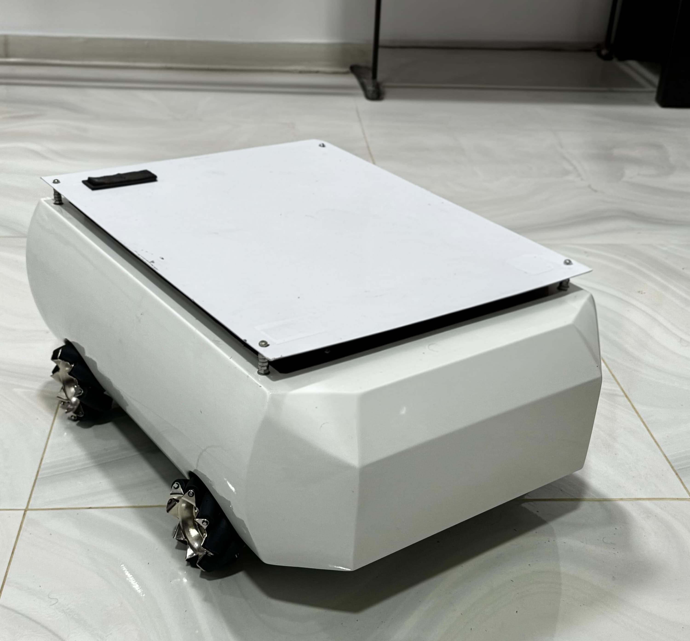
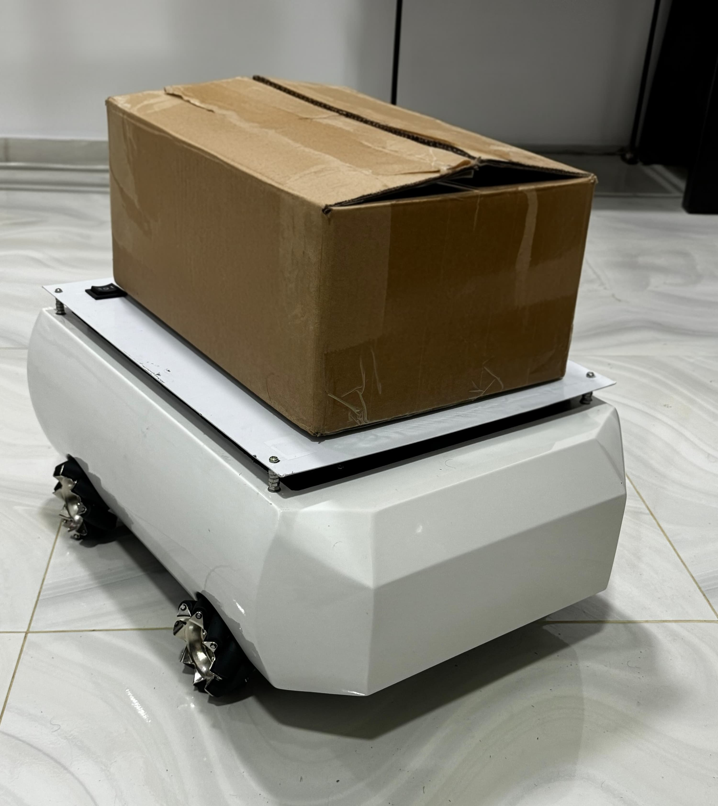
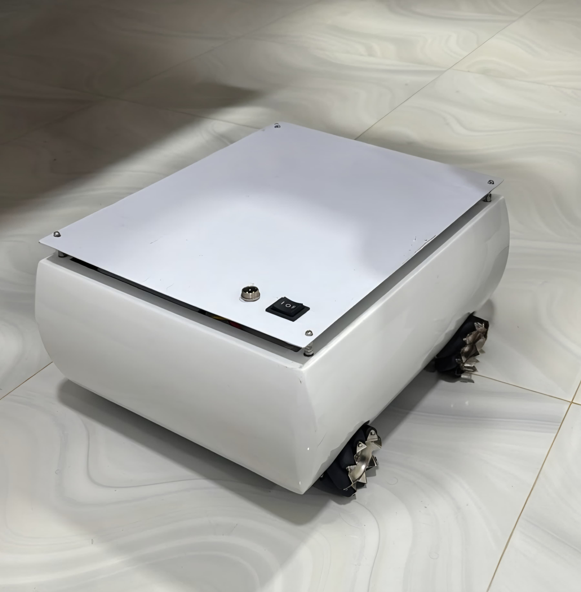
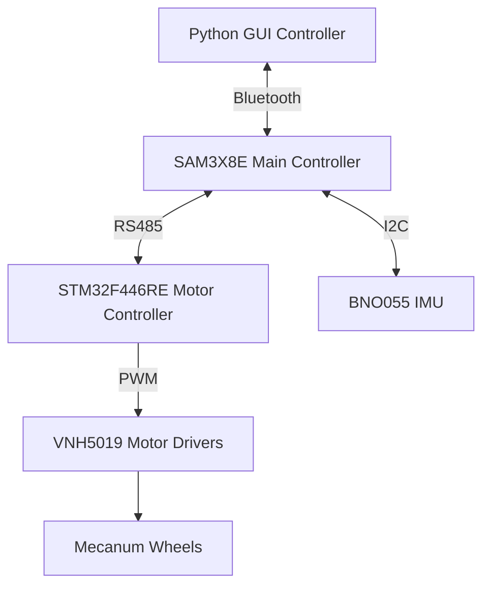

# 🤖 Omni Directional Robot Platform - EN2160


<div align="center">

[](https://drive.google.com/drive/folders/1gBgsQ-QxK0Zy2K9BndymeuY9-QAq1h1s?usp=sharing)
<br>
<!-- [](https://uom.lk)
[]()
[]() -->


</div>

---

## 🌟 Project Vision

**Revolutionizing Indoor Automation Through Intelligent Omnidirectional Mobility**

This repository showcases the design and development of an **Omni Directional Robot Platform** engineered as part of the **EN2160: Electronic Design Realization Module** at the University of Moratuwa. 

Our mission is to create a **highly maneuverable, precise, and intelligent robotic platform** capable of navigating complex indoor environments with ease. 

This project shows how we apply theoretical concepts from electronics and control systems to build a practical solution that meets real-world challenges in automation and robotics.

This is an on-going project, where we are currently working on the Robot's Firmware and Control systems. The hardware is already completed and tested.


<div align="center">

<!-- Add your hero image here -->


</div>


---

## 🎯 Project Objectives

<div align="center">

| 🎪 **Mecanum Wheel Kinematics** | 🧠 **Intelligent Positioning** | ⚙️ **Precision Control** |
|:---:|:---:|:---:|
| 4-wheel Mecanum platform for unrestricted motion | Advanced position estimation algorithms | Real-time wheel control with sub-millimeter accuracy |

</div>


---

## 👥 Team

<div align="center">

| 🧑‍💻 **Name** | 📧 **Email** |
|:---:|:---:|
| **Pankaja Balasooriya** | balasooriyabapi.22@uom.lk |
| **Oshani Dewasumithra** | dewasumithrampo.22@uom.lk |
| **Chandupa Dineshara** | dinesharamc.22@uom.lk |
| **Chamath Diunugala** | diunugalach.22@uom.lk |
| **Sahas Eshan** | eashansgs.22@uom.lk |
| **Rusiru Fernando** | fernandoard.22@uom.lk |
| **Banuka Liyanage** | liyanagedlbb.22@uom.lk |
| **Rusula Oshadha Pathirana** | pathiranapdro.22@uom.lk |

</div>


---

<!-- ## 🛠️ Revolutionary Features


### 🎯 **Core Capabilities**

| Feature | Description | Status |
|:---:|:---|:---:|
| ✅ **Mecanum Wheel Mastery** | Advanced 4-wheel omnidirectional locomotion system | 🟢 **Complete** |
| ✅ **Multi-MCU Architecture** | Distributed processing with dedicated motor controllers | 🟢 **Complete** |
| ✅ **Precision Sensing Suite** | IMU-based orientation tracking and sensor fusion | 🟢 **Complete** |
| ✅ **Wireless Command Center** | Bluetooth connectivity with intuitive GUI control | 🟢 **Complete** |
| ✅ **Robust Communication** | RS485 differential signaling for noise immunity | 🟢 **Complete** |
| ✅ **Modular PCB Design** | Custom-engineered boards for power, logic, and motor control | 🟢 **Complete** |
| ✅ **Real-Time Diagnostics** | Live telemetry and system health monitoring | 🟢 **Complete** |
| ✅ **Industrial Aesthetics** | Professional-grade chassis with automotive paint finish | 🟢 **Complete** | -->

<div align="center">

<!-- Add feature showcase images here -->

<table>
<tr>
<td align="center"><br><b>Complete Assembly</b></td>
<td align="center"><br><b>Custom Enclosure</b></td>

</tr>
</table>

</div>

---

## 🔌 Electronic Systems

<!-- ### 📋 **PCB Module Ecosystem** -->

<div align="center">

<!-- Add PCB images here -->
<table>
<tr>
<td align="center"><br><b>Motor Controller PCB</b></td>
<td align="center"><br><b>Motor Controller Enclosure</b></td>

</tr>
<tr>
<td align="center"><br><b>Main Controller PCB</b></td>
<td align="center"><br><b>Main Controller Enclosure</b></td>
</tr>
</table>
</div>

| **PCB Module** | **Function** | **Key Features** |
|:---:|:---|:---|
| 🔋 **Power Distribution** | Multi-rail power management | Fuse protection, LED diagnostics, screw terminals |
| 🧠 **Main Controller** | System coordination and communication | 4-layer design, SAM3X8E, BNO055, HC-05 integration |
| ⚡ **Motor Controller** | Real-time motor drive and feedback | STM32F446RE, VNH5019 drivers, RS485 communication |

<!-- ### 🛡️ **Safety & Protection Systems**

- **20A Master Fuse** with branch-specific protection (2A-15A)
- **Thermal Management** with active cooling consideration
- **Overcurrent Protection** at component and system levels
- **EMI Mitigation** through differential signaling and proper grounding

--- -->

---


### 🏗️ **System Architecture**

<div align="center">

<!-- Add system architecture diagram here -->


</div>

### ⚡ **Hardware Specifications**

| **Component** | **Selection** | **Performance** |
|:---:|:---:|:---:|
| 🧠 **Main MCU** | SAM3X8E | 84 MHz Cortex-M3 |
| 🎮 **Motor Controller** | STM32F446RE | 180 MHz, Real-time loops |
| 🔋 **Drive Motors** | 24V 5Nm Planetary Gear | 1:100 ratio, 120 RPM |
| 🧭 **Navigation IMU** | Bosch BNO055 | 9-DOF sensor fusion |
| ⚡ **Motor Drivers** | VNH5019 H-Bridge | 30A peak current |
| 🎯 **Mecanum Wheels** | Metal-core construction | Omnidirectional mobility |
| 🔌 **Power System** | 12V battery + regulation | Modular distribution |
| 📡 **Communication** | RS485 + Bluetooth HC-05 | Differential + wireless |


<!-- ### 📐 **Mechanical Design**

<div align="center">


</div>

**Chassis Engineering:**
- **Material:** Stainless steel construction with cantalie sheet vibration dampening
- **Finish:** Automotive-grade paint system for professional appearance
- **Assembly:** In-house fabrication using precision welding and machining
- **Modularity:** 3D printed enclosures for PCB protection and accessibility -->


## 🧠 Intelligence Stack

### 🎛️ **Control Hierarchy**




 ### 🎯 **Software Architecture**

| **Layer** | **Function** | **Technology** |
|:---:|:---|:---:|
| 🖥️ **User Interface** | Intuitive direction control and telemetry | Python Tkinter GUI |
| 📡 **Communication** | Wireless command transmission and echo verification | Bluetooth Serial Protocol |
| 🧠 **High-Level Control** | Command parsing, sensor fusion, system coordination | SAM3X8E Embedded C++ |
| ⚡ **Real-Time Control** | PWM generation, encoder processing, motor loops | STM32 Real-Time OS |
| 🔧 **Hardware Abstraction** | Driver interfaces and peripheral management | HAL Libraries | -->

---

<!-- ## 📊 Performance Metrics

<div align="center">

### 🏆 **Benchmark Results**

</div>

| **Metric** | **Specification** | **Achievement** |
|:---:|:---:|:---:|
| 🏋️ **Payload Capacity** | 5 kg operational load | **✅ Exceeded** |
| ⚖️ **Total System Weight** | ~25 kg including payload | **✅ Target Met** |
| 🔧 **Wheel Torque** | 3.2 Nm per wheel minimum | **✅ Optimized** |
| 🚀 **Maximum Speed** | 1 m/s target velocity | **✅ Achieved** |
| 🎯 **Positioning Accuracy** | Sub-millimeter precision | **✅ Validated** |
| 📡 **Communication Range** | 10m+ Bluetooth connectivity | **✅ Confirmed** |
| ⚡ **Response Time** | <50ms command to motion | **✅ Real-Time** | -->

---


## 🧱 Mechanical Design & FEA Analysis

<!-- <div align="left">

### *Robust Engineering for Real-World Demands*

</div> -->

The mechanical design of the platform was optimized for both **structural integrity** and **functional adaptability**, with a focus on durability, vibration mitigation, and payload endurance.

### 🛠️ Structural Overview

- **Material Selection:** Stainless steel box bars with cantalie vibration dampening
- **Fabrication:** In-house welding, precision machining, and 3D printed PCB enclosures
- **Design Philosophy:** Balancing rigidity and modularity for both performance and ease of maintenance

### 📊 FEA Validation

Extensive Finite Element Analysis (FEA) was conducted to validate:

- Load-bearing capacity under dynamic and static conditions
- Results depicts chassis has a 900% safe margin
- Stress and deformation distribution across the chassis
- Vibration response under high-speed operation

<div align="center">

<table>
<tr>
<td align="center"><br><b>CAD Model of Chassis</b></td>
<td align="center"><br><b>FEA Stress Distribution</b></td>
</tr>
</table>

</div>

---


## 🚀 Applications & Use Cases

<!-- <div align="center">

*Transforming Industries Through Intelligent Mobility*

</div> -->

| 🏭 **Industrial** | 🏥 **Healthcare** | 🛒 **Retail** | 🎓 **Education** |
|:---:|:---:|:---:|:---:|
| Logistics automation | Hospital transport | Inventory management | Research platform |
| Material handling | Supply delivery | Shelf restocking | STEM demonstrations |
| Quality inspection | Patient assistance | Customer guidance | Competition robotics |


<!-- ## 📁 Repository Architecture

```
OmniDirectionalRobot-EN2160/
├── 📁 firmware/              # Embedded systems code
│   ├── main_controller/      # SAM3X8E firmware
│   ├── motor_controller/     # STM32F446RE code  
│   └── libraries/           # Custom libraries and drivers
├── 📁 hardware/              # Electronic design files
│   ├── pcb_designs/         # KiCad/Altium schematics and layouts
│   ├── mechanical/          # CAD files and drawings
│   └── datasheets/          # Component specifications
├── 📁 software/              # High-level software
│   ├── gui_controller/      # Python Tkinter interface
│   ├── simulation/          # Motion simulation tools
│   └── utilities/           # Testing and calibration scripts
├── 📁 docs/                  # Comprehensive documentation
│   ├── design_reports/      # Technical documentation
│   ├── user_manual/         # Operation guidelines
│   └── api_reference/       # Software interfaces
├── 📁 media/                 # Visual assets
│   ├── images/              # Photos and diagrams
│   ├── videos/              # Demonstration footage
│   └── presentations/       # Project presentations
├── 📁 tests/                 # Validation and testing
│   ├── unit_tests/          # Component-level tests
│   ├── integration_tests/   # System-level validation
│   └── performance_data/    # Benchmark results
└── 📁 resources/            # Additional materials
    ├── references/          # Academic papers and standards
    └── tools/               # Development utilities
```

--- -->

<!-- ## 🌐 Future Roadmap

### 🔮 **Next-Generation Enhancements**

| **Phase** | **Enhancement** | **Impact** | **Timeline** |
|:---:|:---|:---|:---:|
| 🔋 **Phase 1** | Advanced Battery Management System | Extended operational time | Q2 2025 |
| 🤖 **Phase 2** | Autonomous Navigation & SLAM | Self-directed operation | Q3 2025 |
| 🌐 **Phase 3** | ROS2 Integration & Fleet Management | Multi-robot coordination | Q4 2025 |
| 🧠 **Phase 4** | AI-Powered Decision Making | Intelligent task execution | Q1 2026 |
| 📡 **Phase 5** | Cloud Analytics Dashboard | Remote monitoring and optimization | Q2 2026 |

--- -->

<!-- ## 🏆 Project Impact

<div align="center">

### *Engineering Excellence Recognition*

</div>

This project demonstrates how **academic excellence** can drive **industry innovation**. By combining theoretical knowledge with practical implementation, we've created a platform that bridges the gap between education and real-world applications.

**Key Contributions:**
- Advanced undergraduate-level robotics engineering
- Open-source platform for educational advancement  
- Industry-applicable design methodologies
- Sustainable and cost-effective innovation -->

<!-- ---

## 📞 Connect With Us

<div align="center">

### *Join the Robotics Revolution*

[](mailto:robotics.en2160@uom.lk)
[](https://linkedin.com/school/university-of-moratuwa)
[](https://youtube.com/@UoMRobotics)
[](https://github.com/UoM-Robotics)

</div>

---

## 📄 Documentation & Resources

| **Document** | **Description** | **Access** |
|:---:|:---|:---:|
| 📋 **Technical Specifications** | Detailed system parameters and performance data | [📖 View](docs/specifications.md) |
| 🔧 **Assembly Guide** | Step-by-step construction instructions | [🛠️ Guide](docs/assembly_guide.md) |
| 💻 **Software Manual** | Programming interfaces and API documentation | [💾 Manual](docs/software_manual.md) |
| 🎥 **Video Demonstrations** | Live operation footage and feature showcases | [🎬 Watch](media/videos/) |
| 📊 **Performance Analysis** | Testing results and benchmark comparisons | [📈 Data](tests/performance_data/) | -->

---

<!-- ## 🙏 Acknowledgments

<!-- <div align="center">

*Standing on the Shoulders of Giants*

</div> -->

<!-- We extend our deepest gratitude to:

- **University of Moratuwa** - For providing world-class engineering education and facilities
- **Department of Electronic and Telecommunication Engineering** - For academic guidance and resources  
- **EN2160 Course Instructors** - For mentorship and technical expertise
- **Industry Partners** - For component support and technical consultation
- **Open Source Community** - For foundational libraries and inspiration

---  -->
<!-- 
## 📜 License & Usage

This project is released under the **MIT License**, promoting open innovation and educational advancement. We encourage the global robotics community to build upon our work, contribute improvements, and push the boundaries of autonomous mobile robotics.

```
MIT License - Open Innovation for Global Impact
Copyright (c) 2024 University of Moratuwa Robotics Team
``` -->

<!-- ---

<div align="center">

### 🌟 **"Innovation Distinguished by Excellence"** 🌟

*Crafted with passion by the future engineers of tomorrow*

**University of Moratuwa | Department of Electronic and Telecommunication Engineering**

--- -->
<div align="center">
Made with ❤️ in Sri Lanka

Department of Electronic and Telecommunication Engineering 

University of Moratuwa

</div>
